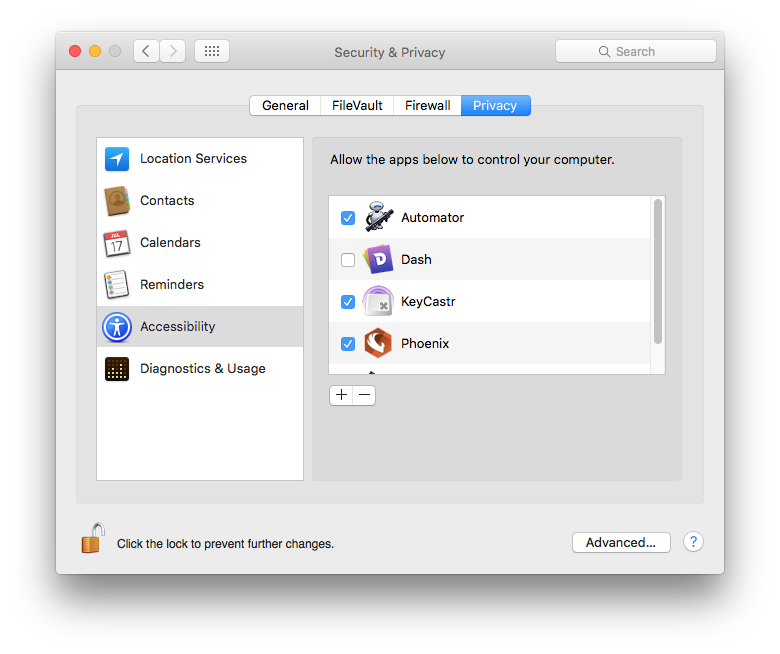

# Keycastr for EmacsGifs

This is a fork of KeyCastr, an open-source keystroke visualizer.

This version is specifically for recording of the GIF guides on
Twitter [@emacs_gifs](https://twitter.com/emacs_gifs) general purpose
OSX/macOS users will almost certainly prefer the original version!

### What Emacs specific stuff is going on?

I needed a visualizer which would be nicer (subjective), for recording
GIFs on emacs_gifs.

I based this on the Svelte visualizer and had some time sucking
problems just building as a new plugin, so I made this fork instead.

The Emacs specific stuff is simple changes to the display of
keystrokes, instead of Mac specific glyphs, this visualizer displays
Esc, Meta, Ctrl, Super.

Tab and Space are also shown as simple text.

## Building

You need OSX to build and run, with XCode installed.

    git clone https://github.com/emacsfodder/keycastr
    cd keycastr/keycastr
    xcodebuild -alltargets
    mv build/Release/KeyCastr.app /Applications/
    open -a KeyCastr

You'll need to open Preferences > Security > Privacy and add/allow
KeyCastr to the list of applications, as you see here.

For more info see the main [keycastr](https://github.com/keycastr/keycastr) repo.

## History

 - [sdeken](https://github.com/sdeken/keycastr) wrote the original version.
 - [akitchen](https://github.com/akitchen/keycastr) fixes for more recent OS X releases and other maintenance.
 - [elia](https://github.com/elia/keycastr) created `keycastr` organization and forked into it.
 - [lqez](https://github.com/lqez/keycastr) added a new menu bar icon.

## License

BSD 3-Clause
